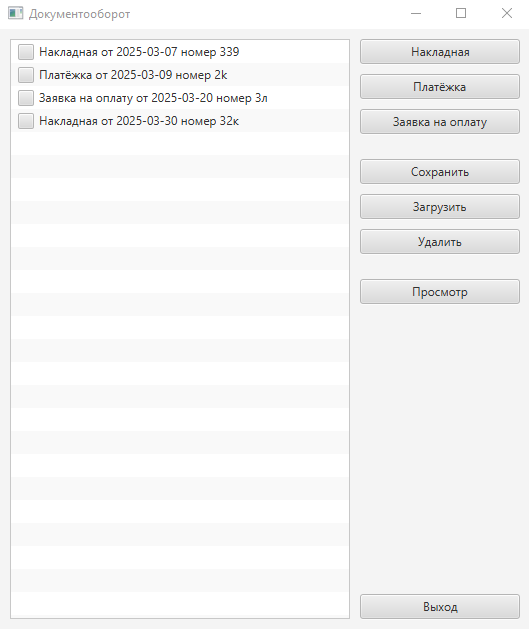
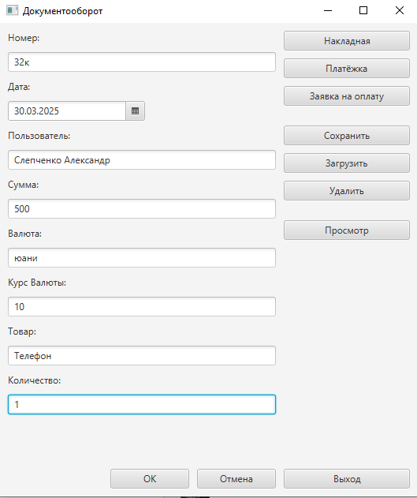
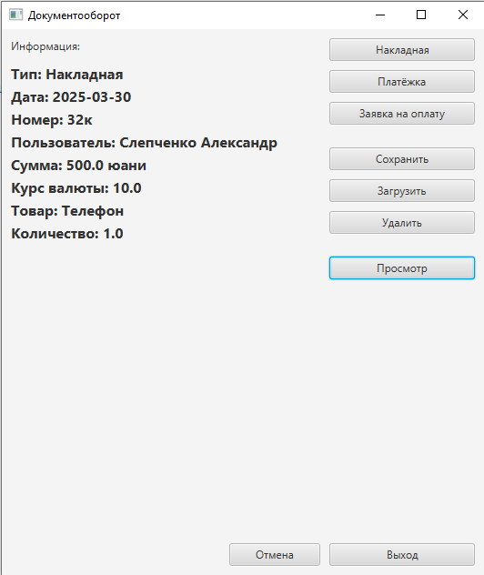
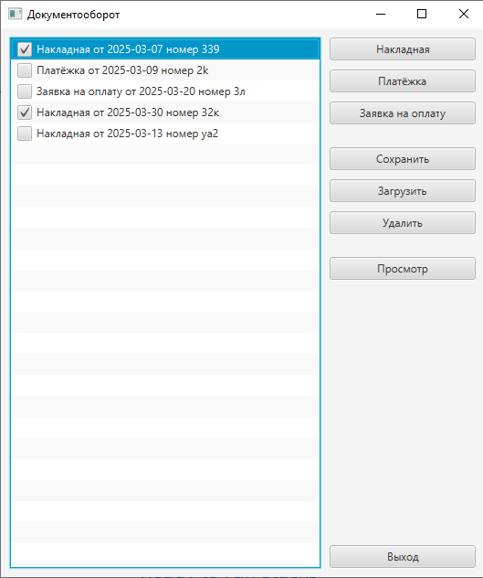
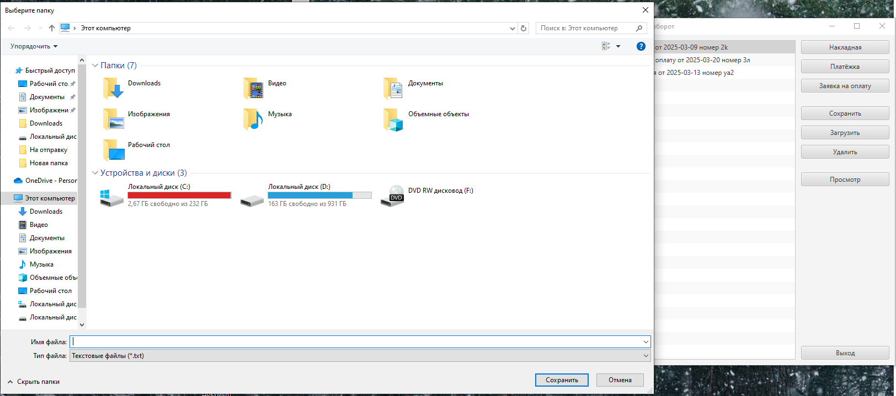

# Проект "Документооборот"

Тестовое задание

## Описание приложения

Десктопное приложение, позволяющее создавать документы трёх видов. В главном меню приложения находится список
всех документов, можно добавлять новые, удалять имеющиеся, а также посмотреть информацию о каждом документе.
Список сохраняется в текстовый файл и параллельно в базу данных, откуда выгружается при запуске приложения. 
Есть возможность загружать список документов из текстового файла. 

## Содержание

- [Описание приложения](#описание)
- [Особенности](#особенности)
- [Технологии](#технологии)
- [Использование](#использование)
- [Интерфейс(Скриншоты)](#Интерфейс (Скриншоты))

## Особенности

- На главном окне приложения список документов с чек-боксами для удаления выбранных
- Список документов можно сохранять в текстовый файл через меню диалога в формате txt
- Список можно загружать так же через меню диалога
- При сохранении в файл, данные списка классифицируются и сохраняются параллельно в базу данных
- Просмотр деталей выбранного документа
- Формы для заполнения и создания документов, а так же информация о документе открываются в том же окне.

## Технологии

- **Java 17**
- **JavaFX 21**
- **PostgreSQL 42.5.4**
- **Hibernate 6.3.1**
- **Maven**
- **Lombok**

### Предварительные требования
- Установленный [Java 17](https://adoptium.net/)
- Установленный [Maven](https://maven.apache.org/)
- Загрузить [JavaFX](https://openjfx.io/)

### Сборка и запуск проекта

1. **Клонируйте репозиторий**:
   ```bash
   git clone https://github.com/Slepchenko/Management

2. ** Соберите проект с помощью Maven:
   ```bash
    mvn clean install

## Использование

В приложении можно заполнять формы для создания трех видов документов, сохранять, загружать, просматривать.

## Интерфейс (Скриншоты)

Главное меню приложения. В левой части список документов, в правой кнопки управления


Первые три кнопки открывают форму заполнения


После подтверждения, документ появляется в списке.
Для просмотра документа, необходимо выбрать его из списка, щелкнуть на нем ЛКМ и нажать на кнопку "Просмотр"


Для удаления ненужных документов необходимо пометить их галочками в чек-боксах и нажать на кнопку "Удалить"


Чтобы сохранить или загрузить список, необходимо нажать на соответствующие кнопки "Сохранить" или "Загрузить"


